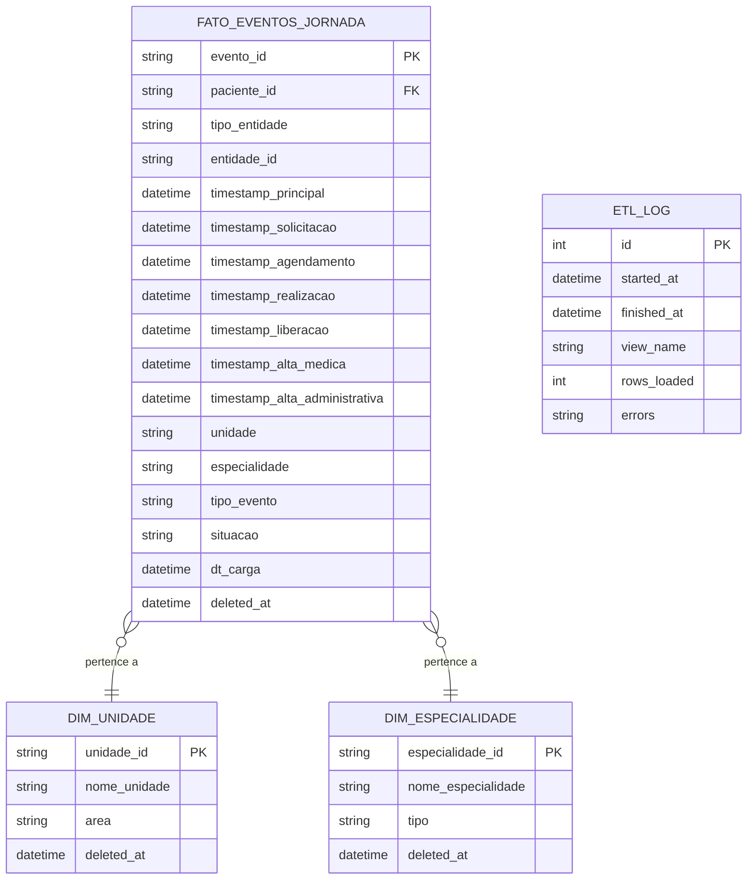

# 04 – Modelo de Dados

**Projeto:** PIJA – Plataforma Integrada da Jornada Assistencial  
**Referência:** Perspectiva Assistencial | HC-UFPE · CIn-UFPE | IESI 2026.1

---

## 1. Modelo Entidade-Relacionamento



---

## 2. Camada de Origem — Views do AGHU (read-only)

Todas as views seguem as convenções:
- Uma linha por ocorrência (evento/gravação)
- `paciente_id` = número do prontuário (somente)
- Timestamps completos (`TIMESTAMP`)
- Campos marcados com `(se existir)` precisam ser confirmados com o DBA do HC-UFPE

### vw_prontuarios_criados

| Campo | Tipo | Obrigatório | Descrição |
|:---|:---|:---|:---|
| paciente_id | VARCHAR | ✓ | Número do prontuário |
| data_hora_abertura_prontuario | TIMESTAMP | ✓ | Momento de criação |
| unidade_criadora | VARCHAR | ✓ | Unidade do usuário criador |
| usuario_criador | VARCHAR | ✓ | Identificador do usuário |
| perfil_criador | VARCHAR | | Perfil do criador (se existir) |

### vw_consultas

| Campo | Tipo | Obrigatório | Descrição |
|:---|:---|:---|:---|
| paciente_id | VARCHAR | ✓ | Número do prontuário |
| consulta_id | VARCHAR | ✓ | Identificador único |
| condicao_atendimento | VARCHAR | ✓ | Regulada, Retorno, Teletriagem, Interconsulta |
| grade | VARCHAR | | Grade de atendimento |
| especialidade | VARCHAR | ✓ | Especialidade médica |
| unidade | VARCHAR | ✓ | Unidade executora |
| data_hora_agendamento | TIMESTAMP | | Momento do agendamento |
| data_hora_agendado | TIMESTAMP | | Data/hora marcada |
| data_hora_realizacao | TIMESTAMP | | Data/hora de realização |
| especialidade_solicitante | VARCHAR | | Para interconsultas (se existir) |
| situacao | VARCHAR | | Status (se existir) |

### vw_exames

| Campo | Tipo | Obrigatório | Descrição |
|:---|:---|:---|:---|
| paciente_id | VARCHAR | ✓ | Número do prontuário |
| exame_id | VARCHAR | ✓ | Identificador único |
| tipo_exame | VARCHAR | ✓ | Categoria/tipo |
| data_hora_solicitacao | TIMESTAMP | ✓ | Momento da solicitação |
| data_hora_agendamento | TIMESTAMP | | Momento do agendamento |
| data_hora_coleta | TIMESTAMP | | Momento da coleta |
| data_hora_realizacao | TIMESTAMP | | Momento da realização |
| data_hora_liberacao | TIMESTAMP | | Momento da liberação |
| unidade_executora | VARCHAR | ✓ | Unidade executora |
| especialidade_solicitante | VARCHAR | | Especialidade solicitante |
| grade | VARCHAR | | Grade |
| condicao_exame | VARCHAR | | Ex: Regulado (se existir) |
| situacao | VARCHAR | ✓ | pendente / realizado / cancelado |

### vw_internacoes

| Campo | Tipo | Obrigatório | Descrição |
|:---|:---|:---|:---|
| paciente_id | VARCHAR | ✓ | Número do prontuário |
| internacao_id | VARCHAR | ✓ | Identificador único |
| data_hora_solicitacao | TIMESTAMP | | Momento da solicitação |
| data_hora_agendamento | TIMESTAMP | | Momento do agendamento |
| data_hora_internacao | TIMESTAMP | ✓ | Internação efetiva |
| especialidade_internacao | VARCHAR | ✓ | Especialidade responsável |
| unidade_internacao | VARCHAR | ✓ | Unidade |
| CID_principal | VARCHAR | | CID da internação |
| situacao | VARCHAR | | Status (se existir) |

### vw_cirurgias

| Campo | Tipo | Obrigatório | Descrição |
|:---|:---|:---|:---|
| paciente_id | VARCHAR | ✓ | Número do prontuário |
| cirurgia_id | VARCHAR | ✓ | Identificador único |
| cirurgia_codigo | VARCHAR | ✓ | Código do procedimento |
| cirurgia_nome | VARCHAR | ✓ | Nome do procedimento |
| especialidade_cirurgica | VARCHAR | ✓ | Especialidade cirúrgica |
| sala | VARCHAR | | Sala cirúrgica |
| data_hora_insercao_lec_antigos | TIMESTAMP | | Inserção na LEC (antigos) |
| data_hora_insercao_lec_novos | TIMESTAMP | | Inserção na LEC (novos) |
| data_hora_lista_pre_op_agendado | TIMESTAMP | | Lista pré-op agendado |
| data_hora_lista_pre_op_realizado | TIMESTAMP | | Lista pré-op realizado |
| data_hora_mapa_cirurgico | TIMESTAMP | | Entrada no mapa |
| data_hora_inicio_anestesia | TIMESTAMP | | Início anestesia |
| data_hora_fim_anestesia | TIMESTAMP | | Fim anestesia |
| situacao | VARCHAR | | Status |

### vw_procedimentos

| Campo | Tipo | Obrigatório | Descrição |
|:---|:---|:---|:---|
| paciente_id | VARCHAR | ✓ | Número do prontuário |
| procedimento_id | VARCHAR | ✓ | Identificador único |
| procedimento_codigo | VARCHAR | ✓ | Código |
| procedimento_nome | VARCHAR | ✓ | Nome |
| especialidade | VARCHAR | ✓ | Especialidade |
| sala | VARCHAR | | Sala |
| data_hora_insercao_lec_antigos | TIMESTAMP | | Inserção LEC (antigos) |
| data_hora_insercao_lec_novos | TIMESTAMP | | Inserção LEC (novos) |
| data_hora_lista_pre_op_agendado | TIMESTAMP | | Lista pré-op agendado |
| data_hora_lista_pre_op_realizado | TIMESTAMP | | Lista pré-op realizado |
| data_hora_mapa | TIMESTAMP | | Entrada no mapa |
| data_hora_inicio_anestesia | TIMESTAMP | | Início anestesia (se houver) |
| data_hora_fim_anestesia | TIMESTAMP | | Fim anestesia (se houver) |
| situacao | VARCHAR | | Status |

### vw_altas

| Campo | Tipo | Obrigatório | Descrição |
|:---|:---|:---|:---|
| paciente_id | VARCHAR | ✓ | Número do prontuário |
| internacao_id | VARCHAR | ✓ | Internação correspondente |
| grade | VARCHAR | | Grade |
| especialidade | VARCHAR | ✓ | Especialidade |
| unidade | VARCHAR | ✓ | Unidade |
| data_hora_alta_medica | TIMESTAMP | ✓ | Alta médica (leito ainda ocupado no sistema) |
| data_hora_alta_administrativa | TIMESTAMP | ✓ | Alta administrativa (leito liberado) |
| tipo_alta | VARCHAR | ✓ | alta clínica, transferência, óbito |

---

## 3. Tabela Central — Banco Local SQLite

### fato_eventos_jornada

Unifica todos os eventos das 7 entidades em estrutura flat para consultas analíticas.

### [SCHEMA] JSON Schema — Evento da Jornada

```json
{
  "$schema": "http://json-schema.org/draft-07/schema#",
  "title": "EventoJornada",
  "type": "object",
  "properties": {
    "evento_id":                   { "type": "string", "minLength": 1 },
    "paciente_id":                 { "type": "string", "minLength": 1 },
    "tipo_entidade":               { "type": "string", "enum": ["PRONTUARIO", "CONSULTA", "EXAME", "INTERNACAO", "CIRURGIA", "PROCEDIMENTO", "ALTA"] },
    "entidade_id":                 { "type": "string" },
    "timestamp_principal":         { "type": "string", "format": "date-time" },
    "timestamp_solicitacao":       { "type": ["string", "null"], "format": "date-time" },
    "timestamp_agendamento":       { "type": ["string", "null"], "format": "date-time" },
    "timestamp_realizacao":        { "type": ["string", "null"], "format": "date-time" },
    "timestamp_liberacao":         { "type": ["string", "null"], "format": "date-time" },
    "timestamp_alta_medica":       { "type": ["string", "null"], "format": "date-time" },
    "timestamp_alta_administrativa":{ "type": ["string", "null"], "format": "date-time" },
    "unidade":                     { "type": ["string", "null"] },
    "especialidade":               { "type": ["string", "null"] },
    "tipo_evento":                 { "type": ["string", "null"] },
    "situacao":                    { "type": ["string", "null"] },
    "dt_carga":                    { "type": "string", "format": "date-time" },
    "deleted_at":                  { "type": ["string", "null"], "format": "date-time" }
  },
  "required": ["evento_id", "paciente_id", "tipo_entidade", "timestamp_principal", "dt_carga"]
}
```

### [SCHEMA] JSON Schema — Response de KPI

```json
{
  "$schema": "http://json-schema.org/draft-07/schema#",
  "title": "KpiResponse",
  "type": "object",
  "additionalProperties": {
    "type": "object",
    "properties": {
      "valor":    { "type": ["number", "null"] },
      "unidade":  { "type": "string" },
      "periodo":  {
        "type": "object",
        "properties": {
          "inicio": { "type": "string", "format": "date" },
          "fim":    { "type": "string", "format": "date" }
        }
      }
    },
    "required": ["valor", "unidade"]
  }
}
```

### [SCHEMA] JSON Schema — Response da Linha do Tempo

```json
{
  "$schema": "http://json-schema.org/draft-07/schema#",
  "title": "JornadaResponse",
  "type": "object",
  "properties": {
    "paciente_id": { "type": "string" },
    "total_eventos": { "type": "integer" },
    "eventos": {
      "type": "array",
      "items": { "$ref": "#/definitions/EventoJornada" }
    },
    "meta": {
      "type": "object",
      "properties": {
        "dt_carga": { "type": "string", "format": "date-time" }
      }
    }
  },
  "required": ["paciente_id", "eventos"]
}
```

---

## 4. Regras de Integridade

1. `paciente_id` nunca pode ser nulo em nenhum registro.
2. `timestamp_principal` nunca pode ser nulo — registros sem ele são rejeitados na carga (log de erro no ETL).
3. Registros com mesmo `entidade_id` + `tipo_entidade` são tratados como upsert — nunca duplicados.
4. **Soft delete obrigatório**: registros inválidos ou cancelados recebem `deleted_at = NOW()` — proibido `DELETE` SQL físico.
5. Registros com `deleted_at IS NOT NULL` são excluídos de todas as queries analíticas por padrão.
6. `dt_carga` permite rastrear a janela de extração de cada registro.

---

## 5. Campos a Validar com o DBA do HC-UFPE

- Disponibilidade de `situacao/status` em `vw_consultas`, `vw_exames`, `vw_internacoes`
- Disponibilidade de `data_hora_agendamento` em `vw_consultas` e `vw_exames`
- Disponibilidade de `data_hora_solicitacao` em `vw_internacoes`
- Consistência do `paciente_id` entre módulos do AGHU
- Disponibilidade e estrutura dos campos LEC em `vw_cirurgias`
