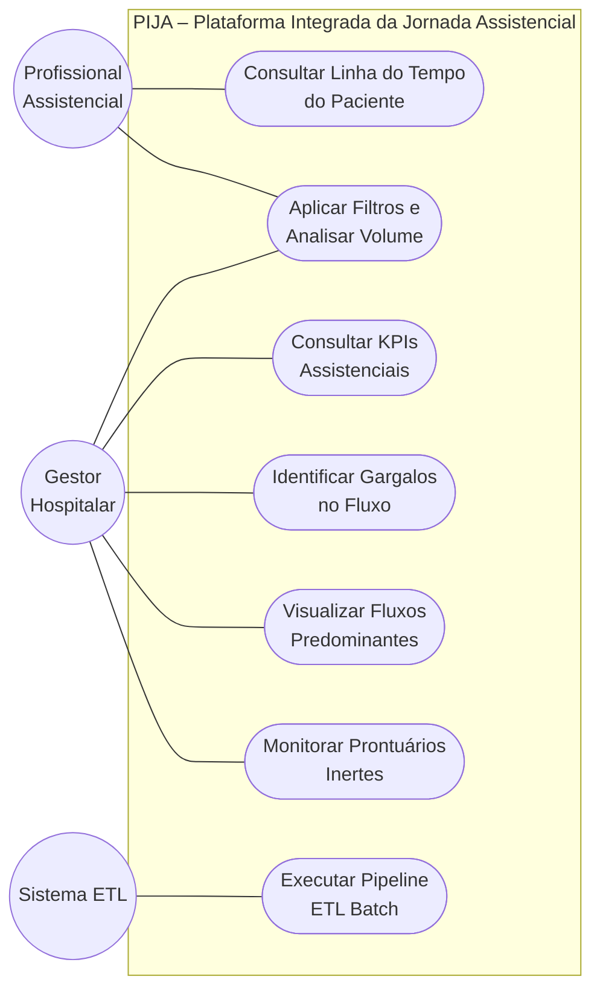

# 03 – Casos de Uso

**Projeto:** PIJA – Plataforma Integrada da Jornada Assistencial  
**Referência:** Perspectiva Assistencial | HC-UFPE · CIn-UFPE | IESI 2026.1

---

## 1. Atores

| Ator | Descrição |
|:---|:---|
| **Gestor Hospitalar** | Coordenador de unidade ou diretoria. Acessa KPIs agregados por unidade/especialidade/período. |
| **Profissional Assistencial** | Médico ou enfermeiro. Acessa linha do tempo de pacientes de sua unidade. |
| **Sistema ETL** | Processo automatizado de extração batch das views do AGHU e carga no banco local. |
| **AGHU** | Sistema legado — fonte primária de dados (somente leitura). |

---

## 2. Diagrama de Casos de Uso

---

## 3. Especificação dos Casos de Uso

### UC001 – Consultar Linha do Tempo da Jornada de um Paciente

**Ator:** Profissional Assistencial, Gestor Hospitalar  
**Pré-condição:** Usuário autenticado com permissão de acesso à unidade do paciente.

**Fluxo principal:**
1. Usuário informa o `paciente_id` no campo de busca
2. Sistema consulta o banco local e recupera todos os eventos do paciente
3. Sistema ordena por `timestamp_principal ASC`
4. Sistema exibe timeline com tipo de evento, data/hora, unidade, especialidade e status

**Fluxo alternativo:**
- 1a. `paciente_id` não encontrado → mensagem "Nenhum evento registrado para este paciente no período disponível"
- 4a. Eventos em múltiplas áreas → agrupamento visual por área (ambulatório, diagnóstico, internação, cirurgia)

**Pós-condição:** Usuário visualiza jornada cronológica completa do paciente.

#### [CARE-UC001] Implementação da Linha do Tempo

- **Context**: Usuário autenticado; `paciente_id` informado via input no frontend Vue 3.
- **Action**: Frontend chama `api.ts → GET /api/v1/jornada/{paciente_id}`; router valida via Pydantic; controller formata eventos em estrutura de cards agrupados por área.
- **Result**: Timeline renderizada com todos os eventos das 7 entidades, sem omissões ou duplicidades, ordenados cronologicamente.
- **Evaluation**: `pytest tests/test_router_jornada.py` — testar paciente com eventos em 3 entidades diferentes; validar ordenação, agrupamento e ausência de duplicatas.

---

### UC002 – Aplicar Filtros e Analisar Volume de Eventos

**Ator:** Gestor Hospitalar, Profissional Assistencial  
**Pré-condição:** Usuário autenticado.

**Fluxo principal:**
1. Usuário seleciona filtros: unidade, especialidade, tipo de evento, período
2. Sistema aplica filtros ao banco local via query parametrizada
3. Sistema exibe volume total, distribuição por tipo e gráfico temporal
4. KPIs do painel são recalculados com base no filtro ativo

**Pós-condição:** Dados exibidos restritos ao recorte selecionado.

#### [CARE-UC002] Implementação dos Filtros

- **Context**: Usuário autenticado; painel carregado com filtros em estado inicial (sem seleção = todos os dados do período padrão).
- **Action**: Frontend envia filtros via query string para `GET /api/v1/eventos`; Pinia store atualiza estado dos filtros; componente Vue reage reativamente; provider executa `sql/eventos_filtrados.sql` com placeholders substituídos.
- **Result**: Dados atualizados sem recarregar a página; KPIs recalculados automaticamente.
- **Evaluation**: `pytest tests/test_filtros.py` — 4 cenários: sem filtro, filtro por unidade, filtro por período, combinação de filtros. Validar contagens contra queries diretas no banco de teste.

---

### UC003 – Consultar KPIs Assistenciais e Operacionais

**Ator:** Gestor Hospitalar  
**Pré-condição:** Usuário autenticado com perfil de gestão.

**Fluxo principal:**
1. Usuário seleciona unidade e período
2. Sistema calcula os KPIs configurados para o recorte
3. Sistema exibe painel com valores numéricos e indicação de tendência

**Fluxo alternativo:**
- 3a. Dados insuficientes para um KPI → "Dados insuficientes para este indicador no período selecionado"

**Pós-condição:** Gestor dispõe de indicadores de desempenho atualizados.

#### [CARE-UC003] Implementação do Painel de KPIs

- **Context**: Usuário com perfil `gestor` autenticado; filtro de unidade e período selecionados.
- **Action**: `GET /api/v1/kpis?unidade=X&data_inicio=Y&data_fim=Z&kpi_codes[]=KPI-01`; `kpi_controller.py` executa os SQLs correspondentes a cada código solicitado e retorna objeto estruturado.
- **Result**: JSON `{ "KPI-01": { "valor": 4.2, "unidade": "dias", "periodo": {...} }, ... }` consumido pelo frontend e renderizado em cards com gráfico de tendência.
- **Evaluation**: `pytest tests/test_kpi_controller.py` — para cada KPI, calcular manualmente no banco de teste e comparar com valor retornado pela API (tolerância: 0%).

---

### UC004 – Identificar Gargalos no Fluxo Assistencial

**Ator:** Gestor Hospitalar  
**Pré-condição:** Banco local com dados de pelo menos um mês de operação.

**Fluxo principal:**
1. Usuário acessa painel de gargalos
2. Sistema calcula tempo médio de espera por transição de evento
3. Sistema exibe ranking por maior tempo médio, segmentado por tipo, unidade e especialidade
4. Usuário clica em um gargalo para ver os eventos que o compõem

#### [CARE-UC004] Implementação do Ranking de Gargalos

- **Context**: Banco local populado; usuário com perfil `gestor` autenticado.
- **Action**: `GET /api/v1/gargalos?unidade=X&data_inicio=Y&data_fim=Z`; `gargalo_controller.py` executa `sql/gargalos.sql` e ordena por `AVG(tempo_espera) DESC`.
- **Result**: Lista ordenada de etapas com tempo médio, volume de eventos e drill-down disponível.
- **Evaluation**: `pytest tests/test_gargalo_controller.py` — inserir dados com tempos conhecidos no banco de teste e validar posição no ranking.

---

### UC005 – Visualizar Fluxos Predominantes

**Ator:** Gestor Hospitalar  
**Pré-condição:** Banco local com dados históricos de jornadas completas.

**Fluxo principal:**
1. Usuário acessa painel de fluxos
2. Sistema agrupa sequências de eventos por padrão de `tipo_entidade`
3. Sistema exibe fluxos por frequência decrescente com volume e proporção

#### [CARE-UC005] Implementação dos Fluxos

- **Context**: Banco local populado com jornadas históricas.
- **Action**: `GET /api/v1/fluxos?especialidade=X&data_inicio=Y&data_fim=Z`; `fluxo_provider.py` executa `sql/fluxos_predominantes.sql`, agrupa sequências por `paciente_id`.
- **Result**: Lista de padrões de jornada (ex: `PRONTUARIO→CONSULTA→EXAME→INTERNACAO→ALTA`) com volume e percentual.
- **Evaluation**: `pytest tests/test_fluxo_provider.py` — dataset de teste com 3 padrões de frequências conhecidas; validar ordenação e proporções.

---

### UC006 – Monitorar Prontuários Inertes

**Ator:** Gestor Hospitalar  
**Pré-condição:** Banco local com dados de prontuários e demais entidades.

**Fluxo principal:**
1. Usuário acessa painel de prontuários inertes
2. Sistema identifica prontuários sem eventos em nenhuma outra entidade após a abertura
3. Sistema exibe volume, percentual e distribuição por período e unidade criadora

#### [CARE-UC006] Implementação dos Prontuários Inertes

- **Context**: Tabela local de eventos populada; `prontuario_controller.py` disponível.
- **Action**: `GET /api/v1/prontuarios/inertes?unidade=X&data_inicio=Y&data_fim=Z`; controller executa `sql/prontuarios_inertes.sql` — LEFT JOIN de prontuários com demais entidades filtrando `COUNT(eventos) = 0`.
- **Result**: `{ "volume": 42, "percentual": 8.3, "distribuicao_por_unidade": [...] }`.
- **Evaluation**: `pytest tests/test_prontuario_controller.py` — inserir 10 prontuários, 3 sem eventos; validar que exatamente 3 aparecem como inertes.

---

### UC007 – Executar Pipeline ETL Batch (Sistema)

**Ator:** Sistema ETL  
**Pré-condição:** AGHU disponível; conexão read-only ativa; banco SQLite local inicializado.

**Fluxo principal:**
1. ETL inicia conforme agendamento
2. Para cada view, extrai registros novos/modificados desde a última extração
3. Normaliza (tipagem, nulos, `evento_id`) e carrega no SQLite via SQLAlchemy
4. Registra log de execução com início, fim, volumes e erros

**Fluxo alternativo:**
- 2a. View indisponível → registra erro, pula a view, continua com as demais, notifica administrador

#### [CARE-UC007] Implementação do ETL

- **Context**: `aghu_resource.py` com pool de conexão ativo; schema SQLite criado via Alembic.
- **Action**: `etl_runner.py` itera pelas 7 views em sequência; executa `.sql` de extração via resource; aplica transformações; usa SQLAlchemy para upsert no SQLite (insert ou update por `entidade_id`).
- **Result**: SQLite atualizado; log salvo em tabela interna `etl_log` com `started_at`, `finished_at`, `view_name`, `rows_loaded`, `errors`.
- **Evaluation**: `pytest tests/test_etl_runner.py` — executar pipeline com banco de teste simulando AGHU; validar volume carregado por view e integridade dos timestamps.
